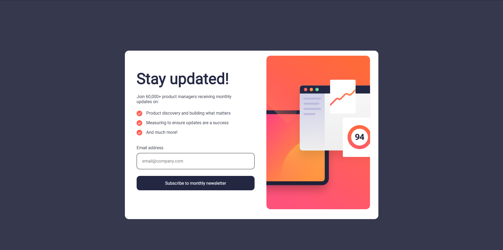
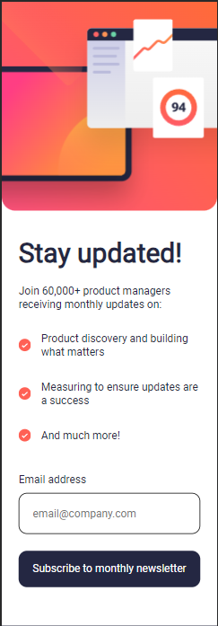

Il s'agit d'une solution au [Formulaire d'inscription à la newsletter avec message de réussite sur Frontend Mentor](https://www.frontendmentor.io/challenges/newsletter-signup-form-with-success-message-3FC1AZbNrv). Les défis Frontend Mentor vous aident à améliorer vos compétences en codage en construisant des projets réalistes. 

## Table of contents

- [Aperçu](#Aperçu)
  - [Le-challenge](#le-challenge)
  - [Screenshot](#screenshot)
  - [Liens](#Liens)
  - [Développé avec :](#développé-avec)
- [Auteur](#Auteur)

## Aperçu

### Le challenge : 

- Ajoutez leur adresse e-mail et soumettez le formulaire 
- Voir un message de réussite avec leur adresse e-mail après avoir envoyé le formulaire avec succès 
- Voir les messages de validation du formulaire si : - Le champ est laissé vide 
- L'adresse e-mail n'est pas formatée correctement - Afficher la disposition optimale de l'interface en fonction de la taille de l'écran de l'appareil 
- Affichez les états de survol et de focus pour tous les éléments interactifs de la page

### Screenshot

### Liens

- Solution URL: [Reposit GitHub](https://github.com/CallMeAl3x/Newsletter)
- Live Site URL: [Site Live](https://newsletter-b-alexandre.netlify.app)

### Développé avec

- HTML5
- CSS 

## Auteur

- Frontend Mentor - [@CallMeAl3x](https://www.frontendmentor.io/profile/CallMeAl3x)
